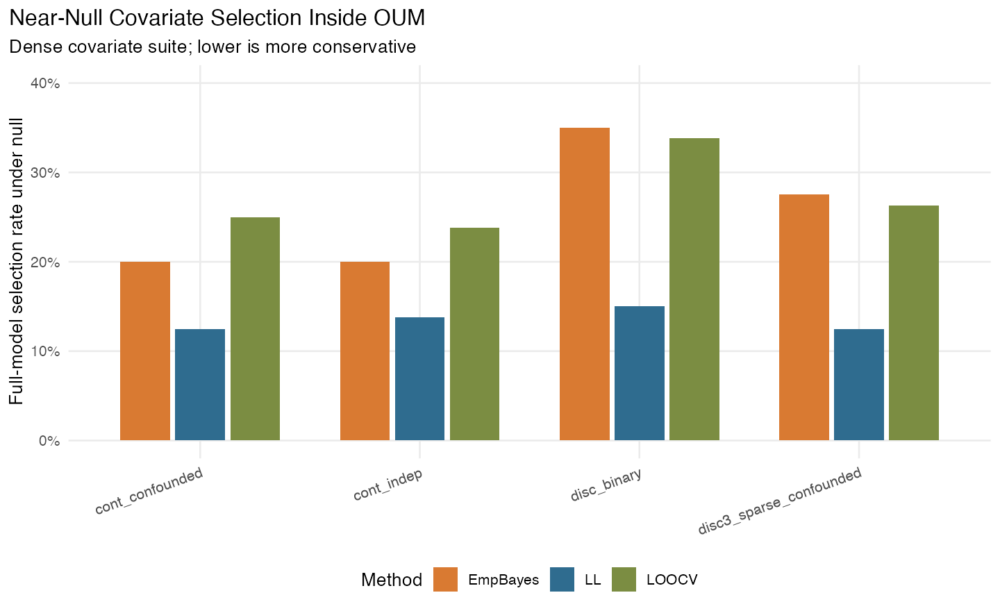
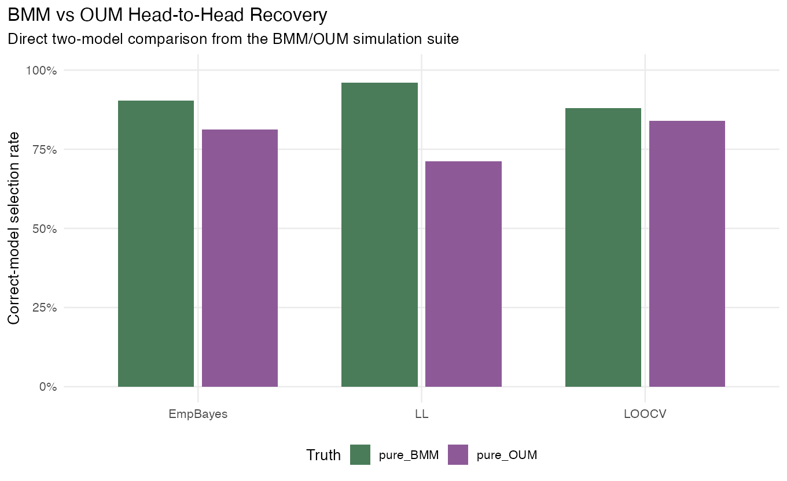
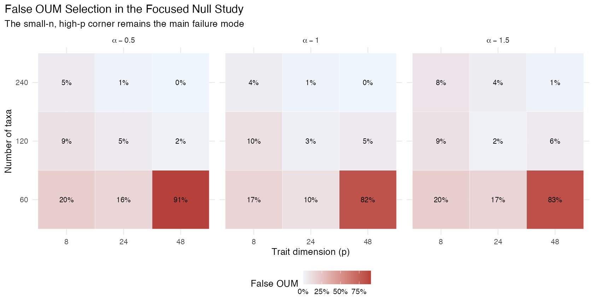
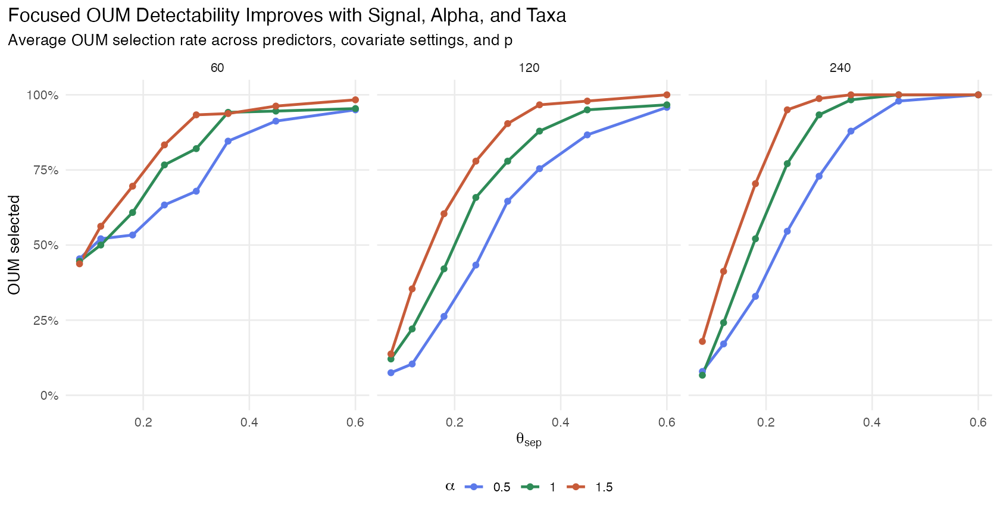
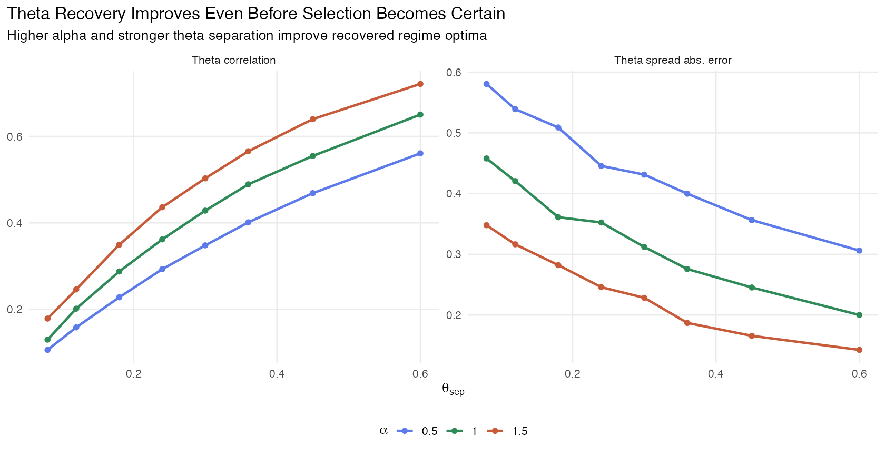
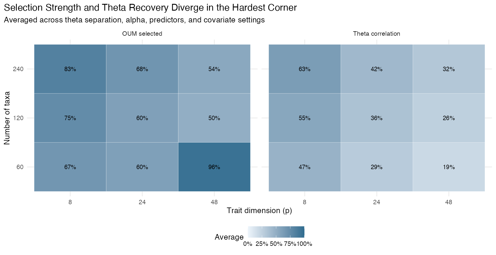

# OUM Simulation Summary Report

Generated on 2026-03-24 14:54 EDT

## Provenance

- Figures and summaries for the focused theta-recovery study are generated directly from local pulled CSVs in `archon-pulls/tg18/tests/`.
- Earlier Archon campaigns reused the same remote workspace, so some of their raw CSV outputs were overwritten later.
- For those earlier campaigns, the report uses the quantitative results recorded during the session and labels them as reconstructed summaries.

## Executive Summary

- The `mvgls(model = "OUM")` covariate path is mechanically solid: it fit successfully, preserved covariates through prediction and downstream methods, and behaved sensibly on real data and targeted tests.
- Within OUM, covariate detection is strong once signal is present, but near-null model selection is softer for discrete predictors and for more permissive selection methods (`LOOCV`, `EmpBayes`) than for `LL`.
- Head-to-head `BMM` vs `OUM` comparisons under `GIC` are asymmetric: `BMM` is recovered strongly, while `OUM` is much easier to miss, especially when candidate sets include shared models.
- Direct `OU` vs `OUM` comparison is better calibrated than `BMM` vs `OUM`, but still weak in mixed or high-dimensional small-sample settings.
- The strongest new result is that `theta` recovery is materially better than model selection alone suggests. In favorable settings, regime optima can be estimated well even before `OUM` wins every model comparison.

## 1. OUM With Covariates: What Worked

- The implementation now supports standard covariate adjustment inside OUM fits, including painted `simmap` trees and ordinary regression covariates such as `log(mass)`.
- Targeted tests showed that the updated OUM path works with `LL`, penalized fits, `EmpBayes`, `error=TRUE`, `predict()`, `ancestral()`, `manova.gls()`, `GIC()`, and `EIC()`.
- On a real `phyllostomid` example, OUM plus a size covariate fit cleanly and returned both regime-optimum rows and regression-effect rows in the coefficient matrix.

## 2. Covariate Selection Inside OUM (Reconstructed From Dense Covariate Suite)

- In the near-null region, false full-model selection ranged from about 12.5% to 35.0%, with `LL` consistently more conservative than `EmpBayes` and `LOOCV`.
- Weak, medium, and strong signal settings selected the full covariate model essentially perfectly across methods in that suite.

## 3. BMM vs OUM Head-to-Head (Reconstructed From Direct Two-Model Suite)

- In the direct `BMM` vs `OUM` comparison, recovery was asymmetric.
- Under pure `BMM` truth, the correct model was selected LL: 96.1%, EmpBayes: 90.4%, LOOCV: 87.9%.
- Under pure `OUM` truth, the correct model was selected LL: 71.2%, EmpBayes: 81.3%, LOOCV: 83.9%.
- In the same study, the shared null was still heavily tilted toward `BMM`, which was the first strong warning that raw `GIC` comparisons were not neutral between these model families.

## 4. Four-Model Calibration (Reconstructed From BM/OU/BMM/OUM Suite)

- When the candidate set included `BM`, `OU`, `BMM`, and `OUM`, the shared-model truths were recovered asymmetrically: the correct model won 46.6% under shared BM truth and 82.4% under shared OU truth.
- In that calibration run, `OUM` was almost never the winner in the OUM frontier or mixed-signal phases. This showed that lack of an `OUM` win is weak evidence against optimum shifts when the candidate set is broad.

## 5. Direct OU vs OUM Detectability (Reconstructed From Dedicated Detectability Suite)

- Direct `OU` vs `OUM` comparison was better calibrated than `BMM` vs `OUM`: false `OUM` selection under shared-OU truth averaged 4.7% for balanced painted regimes and 9.2% for imbalanced regimes.
- But even there, detectability was limited: only 182 of 2400 pure-OUM frontier cells crossed 50% `OUM` selection, and only 42 crossed 80%.
- Under BM-rate misspecification, detectability collapsed further: only 29 of 4032 misspecified cells crossed 50% selection, and only 1 crossed 80%.
- That suite also showed alpha collapse under misspecification: both `OU` and `OUM` estimated low alpha values regardless of the true simulated alpha.

## 6. Focused Theta-Recovery Study (Raw CSVs Pulled Locally)

- This focused study used the regime where OUM looked most promising: 2 imbalanced painted regimes, higher alpha, stronger theta separation, and varying `n` and `p`.
- Overall false `OUM` selection under the null was 16.0%, but the failure mode was very concentrated.
- By number of taxa, false `OUM` selection fell from 39.5% at `n=60` to 5.9% at `n=120` and 2.8% at `n=240`.
- By trait dimension, the main pathological corner was `p=48`, where the average false `OUM` rate was 30.1%.

- Under pure simulated OUM, detectability improved strongly with theta separation: `OUM` was selected 22.2% at `theta_sep = 0.08`, 52.0% at `0.18`, 82.4% at `0.30`, and 97.9% at `0.60`.
- Higher alpha helped both selection and recovery. Average `OUM` selection rose from 59.8% at `alpha = 0.5` to 76.3% at `alpha = 1.5`.
- The fitted alpha values tracked the truth well in this focused regime: mean `alpha_hat` for OUM was 0.5 -> 0.85; 1 -> 1.36; 1.5 -> 1.88.

- Theta recovery improved even before selection became certain. Average theta correlation rose from 0.14 at `theta_sep = 0.08` to 0.64 at `theta_sep = 0.60`.
- At the same time, theta spread absolute error fell from 0.462 to 0.216.
- More taxa were consistently helpful: theta RMSE was n=60 -> 0.097; n=120 -> 0.078; n=240 -> 0.062.
- Trait dimension changed the quality of recovery more than the raw RMSE. Theta correlation averaged p=8 -> 0.55; p=24 -> 0.36; p=48 -> 0.26, showing that the high-dimensional corner stays hard even when absolute RMSE looks similar.
- In a favorable design (`n=240`, `p=8`, `alpha=1.5`), the empirical 50% and 80% selection thresholds were about 0.080 and 0.135; at `p=24` with the same `n` and `alpha`, they rose to about 0.135 and 0.195.
- The `n=60, p=48` corner remained pathological: it often selected `OUM` strongly under the null while yielding poor theta correlation, so those cells should not be interpreted as genuine detectability wins.

## Practical Takeaways

- The new OUM regression path is software-correct enough to use for size-adjusted multivariate analyses with painted regimes.
- For model selection, `LL` is the safest default. `LOOCV` and `EmpBayes` are more permissive near the null.
- Direct `OU` vs `OUM` comparison is more interpretable than `BMM` vs `OUM` when the scientific question is about optimum shifts.
- Failure to select `OUM` is weak evidence against optimum shifts unless the dataset is in a favorable regime.
- The favorable regime looks like: moderate-to-high alpha, sufficiently separated regime optima, at least about 120 taxa, and preferably not extreme small-n/high-p settings.
- If the primary goal is recovering regime optima rather than just model selection, this focused study suggests theta can be estimated usefully even when `OUM` is not yet winning every comparison.
